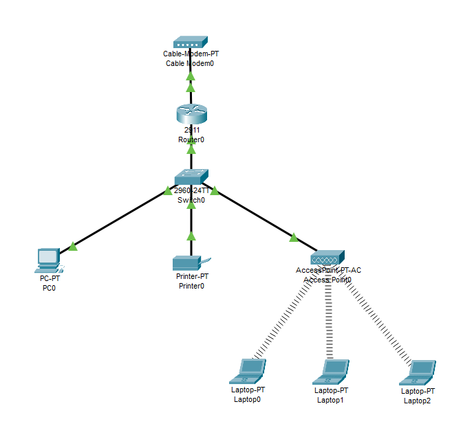
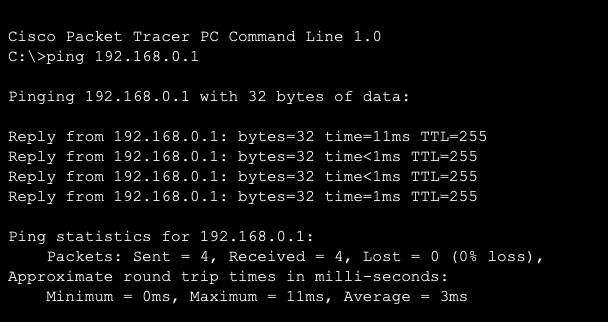
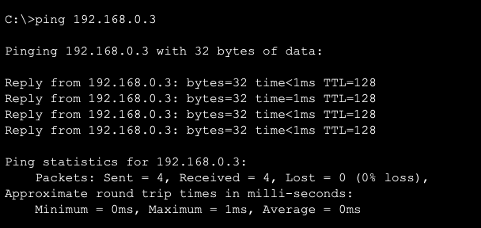
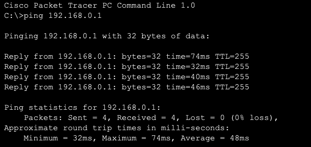
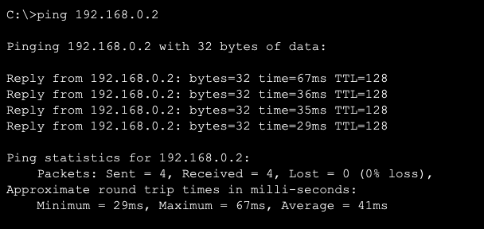
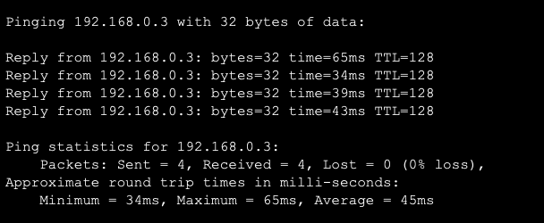
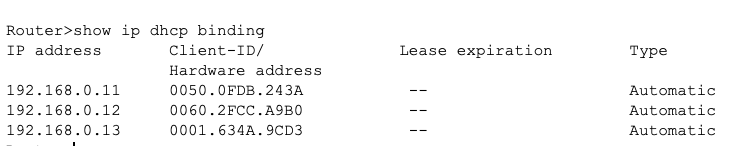

<h1>SOHO Network</h1>

<h2>Project Overview</h2>
<strong>Project Name:</strong> Auxilium Education SOHO Network Setup <br />
<strong>Purpose:</strong> To design and configure a reliable, secure, and functional small office network for a small business. <br />
<strong>Network Components:</strong>

- 1 Router (Cisco 2911) <br />
- 1 Switch (Cisco Catalyst 2960) <br />
- 1 Access Point <br />
- 1 Desktop PC <br />
- 3 Laptops (wireless devices) <br />
- 1 Printer <br />
- 1 Modem for internet access 
<br />


<h2>Network Topology</h2>


<br />
The diagram above illustrates the logical layout of the network, showing connections between the modem, router, switch, access point, and end devices.

<h2>IP Addressing Scheme</h2>
<table>
 <tr>
  <th>Device</th>
  <th>Interface/Port</th>
  <th>IP Address</th>
  <th>Subnet Mask</th>
  <th>Notes</th>
 </tr>
 <tr>
  <td>Router0</td>
  <td>GigabitEthernet0/0 (WAN)</td>
  <td>DHCP</td>
  <td>N/A</td>
  <td>Receives IP from modem</td>
 </tr>
  <tr>
  <td>Router0</td>
  <td>GigabitEthernet01 (LAN)</td>
  <td>192.168.0.1</td>
  <td>255.255.255.0</td>
  <td>LAN Default Gateway</td>
 </tr>
  <tr>
  <td>Switch0</td>
  <td>GigabitEthernet0/1</td>
  <td>N/A</td>
  <td>N/A</td>
  <td>Connected to Router0</td>
 </tr>
  <tr>
  <td>PC0</td>
  <td>FastEthernet0/1</td>
  <td>192.168.0.2</td>
  <td>255.255.255.0</td>
  <td>Static IP</td>
 </tr>
  <tr>
  <td>Printer0</td>
  <td>FastEthernet0/2</td>
  <td>192.168.0.3</td>
  <td>255.255.255.0</td>
  <td>Static IP</td>
 </tr>
  <tr>
  <td>Access Point</td>
  <td>Ethernet Port</td>
  <td>Bridged</td>
  <td>N/A</td>
  <td>Wireless Bridge</td>
 </tr>
  <tr>
  <td>Laptop 0, Laptop1, Laptop2</td>
  <td>Wireless</td>
  <td>DHCP</td>
  <td>255.255.255.0</td>
  <td>Dynamic IP via Router0 DHCP</td>
 </tr>
</table>

<h2>Device Configurations</h2>
<h3>Router (Cisco 2911)</h3>
The router handles DHCP, provides the default gatewa, and connects the netwrosk to the modem(WAN).
<br />
<h3>Router Configuration</h3>

```sh
enable
configure terminal

# WAN Interface - Connect to Modem
interface GigabitEthernet0/0
 ip address dhcp
 no shutdown
 exit
 # LAN Interface - Connect to Switch
interface GigabitEthernet0/1
 ip address 192.168.0.1 255.255.255.0
 no shutdown
 exit

# DHCP Configuration
ip dhcp excluded-address 192.168.0.1 192.168.0.10
ip dhcp pool AUXILIUM_LAN
 network 192.168.0.0 255.255.255.0
 default-router 192.168.0.1
 dns-server 8.8.8.8
exit

# Save Configuration
write memory
```
<h2>Switch (Cisco Catalyst 2960)</h2>
The switch connects all devices and ensures proper communication.
<br />
<h3>Switch Configuration</h3>

```sh
enable
configure terminal

# Port connected to Router
interface GigabitEthernet0/1
 description Connected to Router
 switchport mode access
 no shutdown
 exit

# Port connected to Access Point
interface GigabitEthernet0/2
 description Connected to Access Point
 switchport mode access
 no shutdown
 exit

# Port connected to PC0
interface FastEthernet0/1
 description Connected to PC0
 switchport mode access
 no shutdown
 exit

# Save Configuration
write memory
```
<h2>Access Point</h2>
The Access Point provides wireless connectivity for laptops.
<br />
<h3>Wireless Configuration</h3>
- SSID: SmallBusiness_Network <br />
- Security Mode: WPA2-PSK <br />
<h2>End Devices</h2>
<table>
 <tr>
  <th>Device</th>
  <th>IP Configuration</th>
  <th>Notes</th>
 </tr>
 <tr>
  <td>PC0</td>
  <td>Static IP: 192.168.0.2</td>
  <td>Connected via Ethernet Cable</td>
 </tr>
  <tr>
  <td>Printer0</td>
  <td>Static IP: 192.168.0.3</td>
  <td>Connected via Ethernet Cable</td>
 </tr>
  <tr>
  <td>Laptops</td>
  <td>DHCP Assigned (192.168.0.x)</td>
  <td>Connected via Access Point</td>
 </tr>
</table>

<h2>Testing and Verification</h2>
<h3>Ping Tests</h3>
From PC0(Wired) <br /> <br />




From Laptops (Wireless) <br /> <br />





<h2>DHCP Verification</h2>
On the router we are going to run:

```sh
show ip dhcp binding
```
to verify the laptops receive IP addresses dinamically.



<h2>Future Improvements</h2>
To enhance security and performance, the following improvements are recommended: <br />

- Firewall: Add a Cisco ASA Firewall or configure router ACLs. <br />
- VLANs: Segment the network to isolate devices (e.g., wired devices, wireless clients, and printers). <br />
- IDS/IPS: Add an Intrusion Detection/Prevention System to monitor network traffic. <br />
- Centralized Server: Implement a server for DHCP, DNS, and file sharing. <br />
- Monitoring Tools: Use Syslog or SNMP for network monitoring and visibility. <br />

<h2>Files Included</h2>
You can download the Packet Tracer project file <a href=https://github.com/VyktorX/SOHONetwork/blob/main/SmallBusiness_Network.pkt>here</a>

<h2>Conclusion</h2>
This documentation outlines the successful design and configuration of a SOHO network for a small business. The network provides both wired and wireless connectivity, dynamic IP assignment via DHCP, and efficient routing through a Cisco 2911 router. Future improvements will focus on security enhancements and scalability.
